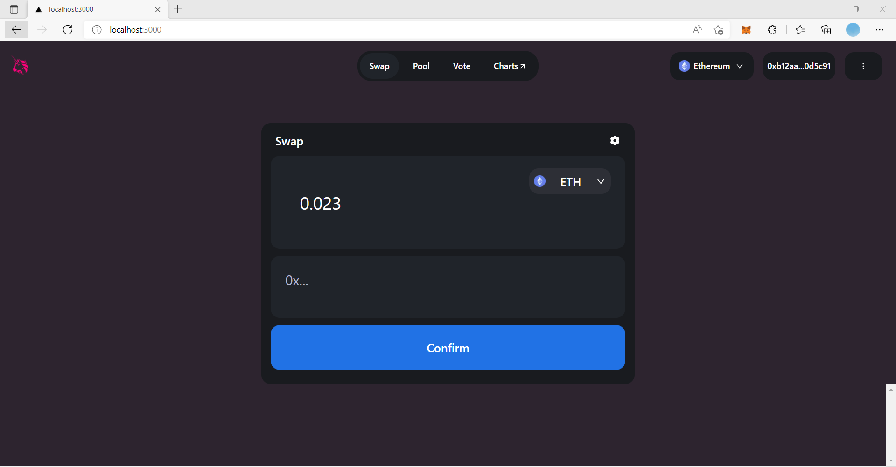

# React Native [Web] + Monorepo

# Table of contents

- [Used of Technologies](#used-of-technologies)
- [Getting Started](#getting-started)
- [Folder Structure](#folder-structure)
- [Assets](#assets)
- [Learn](#learn)
- [About](#about)

---

## 

# Used of Technologies

1.  React
2.  NextJS
3.  UI Framework - `Tailwind` (web, mobile)

4.  Blockchain Language - `Solidity`
5.  Identity and Auth. - `MetaMask`
6.  Developer Framework - `Hardhat`
7.  Blockchain - `Ethereum`
8.  Blockchain Database - `Sanity.io`
9.  Web3 Library - `Alchemy (Rinkeby Network)`

---

# Getting Started

1. Install dependencies `yarn install`

```bash
# to install dependencies
yarn
# or
yarn install
```

Available commands:

```bash

# to start front-end on localhost:3000 from "client" folder
$ yarn dev

# to start sanity database on localhost:3333 from "studio" folder
$ sanity start

# to start compile and deploy solidity smart contracts from "smart_contracts" folder
$ npx hardhat compile
$ npx hardhat run scripts/deploy.js --network rinkeby

```

## Folder Structure

```
├── client
│   ├── assets # Asset files (png, jpeg, json, etc)
│   ├── components # UI components
│   ├── context # context API to store functional variables to draw from
│   ├── lib # sanity client files
│   └── pages # NextJS pages
│
│── smart_contracts
│   ├── contracts # smart contracts (.sol files)
│   ├── scripts # sanity async.await function to deploy database
│
│
│__ studio
    ├── schemas # functionality schema files


```

---

## Assets

common assets (such as pictures, logos, background images, etc...) that want to shared across projects & packages, can be stored under folder `packages/common-assets`.

```TypeScript
// In react project
import logo from "@common/assets/static/logo-brand.png";


// In react native project
import { Image } from "react-native";

const logo = require("@common/assets/static/logo-brand.png");
<Image source={logo} />

```

### Tailwind

For tailwind theme configuration, you may update the `tailwind.config.js` under `packages/ui-theme` folder.

If you wish to have advanced configuration, please checkout the [official documentation](https://tailwindcss.com/docs/configuration) for customization.

#### Example

To apply tailwind style for `react` or `react-native` project, you can do something like below:

```TypeScript
// in react-native project use with `@ui/theme` for styling
import { View } from "react-native";
import { Text } from "@ui/native";
import { tw } from "@ui/theme";

<View style={tw("bg-primary")}>
  <Text>View with primary color background</Text>
</View>

// if you are working on react project, just do as simple like below
<div className="bg-primary">
  View with primary color background
</div>
```

##### Caveat:

1. There are limited css classname supported for `React Native`, you can checkout this [repo](https://github.com/vadimdemedes/tailwind-rn#supported-utilities) for more information
2. Whenever there is a new update on `tailwind.config.js`, please remember to run `yarn theme:generate` in order apply changes on `React Native`

---

# Learn

### React Native

A framework for building native apps using React. For more information please checkout [official documentation](https://reactnative.dev/)

### Tailwind Css

A utility-first CSS framework for rapid UI development. For more infomation & details please checkout the [official documentation](https://tailwindcss.com/docs).

Oh Wait! There are some awesome references for UI components as well

1. https://tailwindui.com/components
2. https://tailblocks.cc/
3. https://tailwindtemplates.io/
4. https://component.tailwindow.com/
5. https://www.tailwindtoolbox.com/
6. https://tailwindcomponents.com/

### Styled Component

1. Official Docs - https://styled-components.com/
2. Github - https://github.com/styled-components/styled-components

---

# About

Doc created by LASIYA PRIYAN
